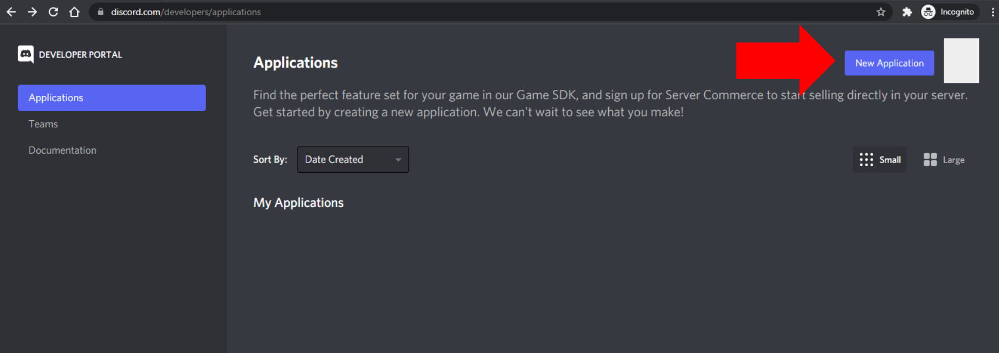
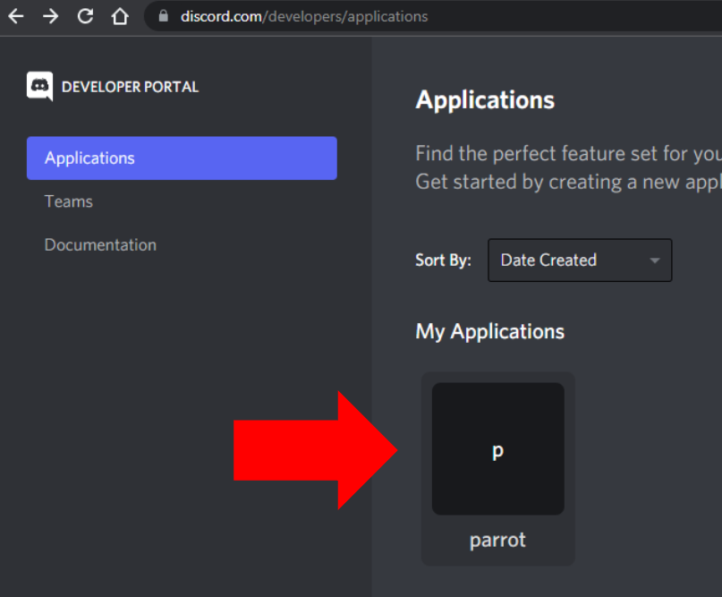
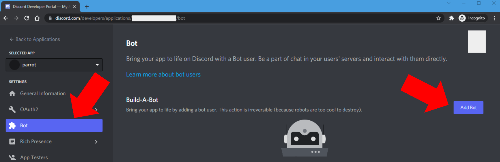
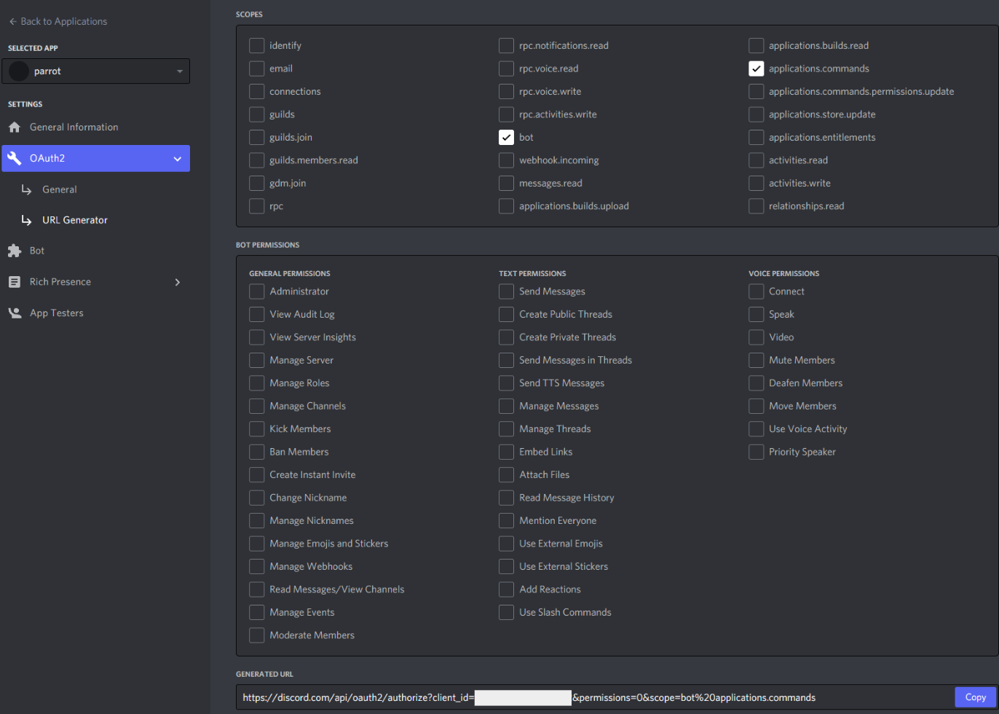
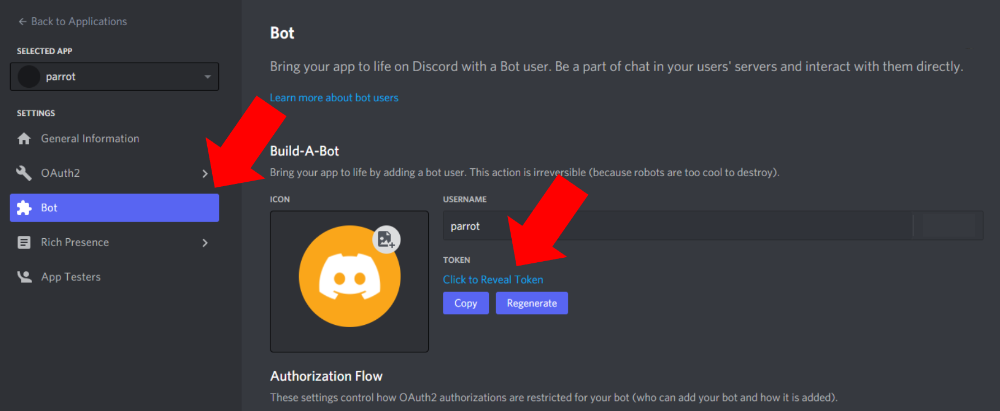
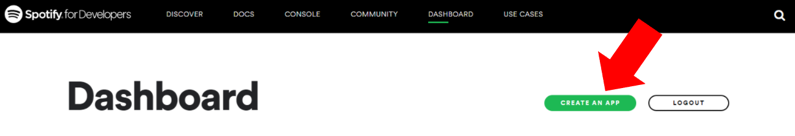
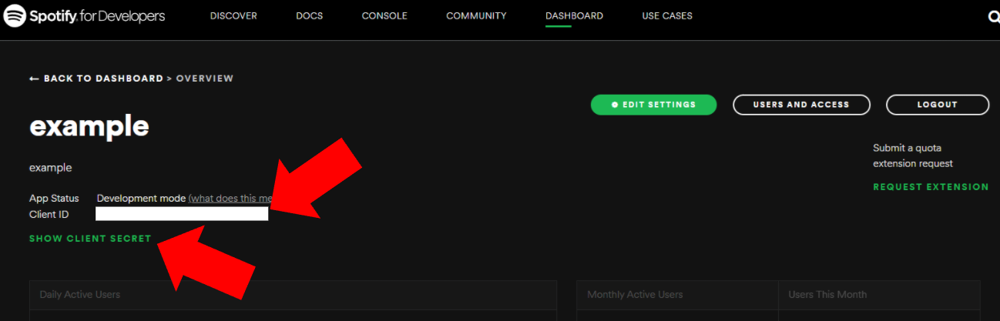

# CREATING DEPLOYMENT SECRETS

> Last updated December 31, 2021

This document describes how to deploy your own private instance of the Parrot Discord bot to your Discord Guild (server).

I assume you already have a VPS or device to host the bot on.

For this document, the word __"server" is used interchangeably with "Discord Guild"__.

1. The first section lists how to register the bot to Discord so you can join it to your server.

2. The second section shows where to find the Discord bot token which is used to authenticate the bot.

3. (Optional) The third section shows where to find Spotify Developer secrets so the bot can look up song meta data for the playlist-similarity feature.

## 1. Register bot with Discord and join it to your server.
Registering the bot with Discord sort of "creates an account" for your bot so you can join it to your Discord server. 

1. Sign into [Discord.com/developers/applications]("https://Discord.com/developers/applications") and create a new application, give it a name. I'll call mine ``parrot`` but you can name it whatever you want.

2. Click on the application you just created.

3. In the next screen click on "Bot" in the left menu and then click "Add Bot". Confirm you want to create a new bot.

4. Click on "OAuth2" on the left menu and click "URL Generator". Set the following permissions and go to the link in the bottom to add your bot to your server.

## 2. Discord Bot Token
The discord bot token is used to authenticate the bot with Discord's services.

Anyone who gets this token can authenticate and act as your bot on whatever server your bot is joined to.

1. Click on "Bot" from the left menu, the bot's secret token is here.

## 3. Spotify Secrets (Optional)
Spotify secrets enable the bot to look up song meta data for playlist generation.
If secrets are not provided, the bot won't make lookup calls to Spotify's databases for similarity-playlists and will only use its local DB.

1. Sign into Spotify Developer [developer.spotify.com](https://developer.spotify.com/dashboard/applications) and create a new app, give it a name and description. I'll call mine example but you can name it whatever you want.

2. Click on the app you created. Your SPOTIFY_CLIENT and SPOTIFY_SECRET are found on this page.

