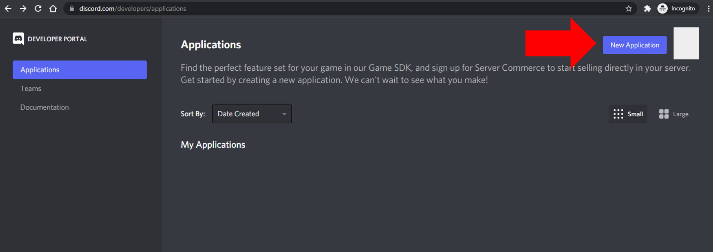
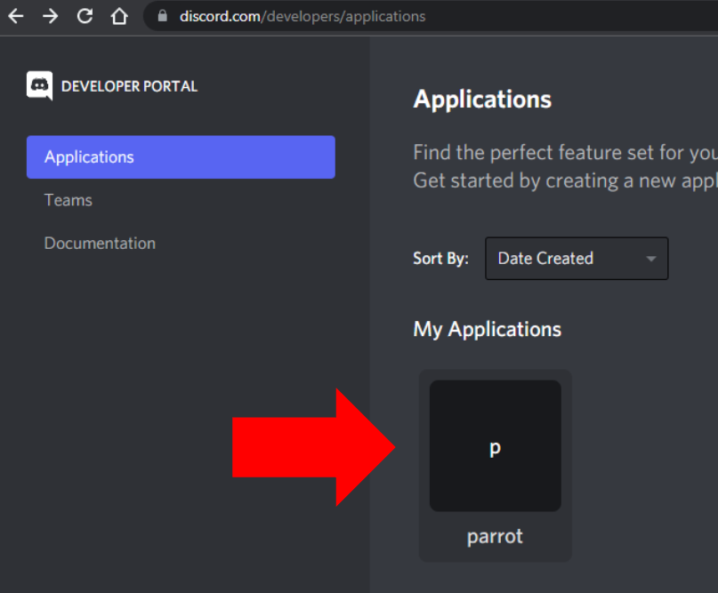
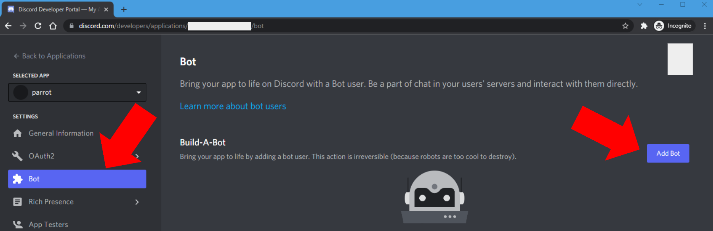
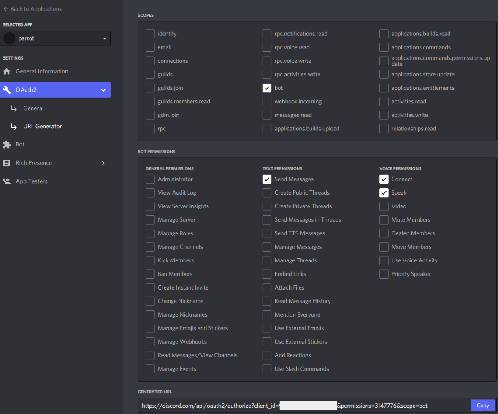

This document describes how to self-host your own private instance of Parrot.

## 1. Discord Developer Application Setup
1. Sign into [discord.com/developers/applications]("https://discord.com/developers/applications") and create a new application, give it a name. I'll call mine ``parrot`` but you can name it whatever you want.

2. Click on the application you just created.

3. In the next screen click on "Bot" in the left menu and then click "Add Bot". Confirm you want to create a new bot.

4. Click on "OAuth2" on the left menu and click "URL Generator". Set the following permissions and go to the link in the bottom to add your bot to your server.

## 2. Deploy
1. WIP

### 2.1 Deploy to Heroku
1. WIP

### 2.2 Deploy to Linode
1. WIP